# Prepare Demo Environment (Azure)

## Create Mirosoft account

Go to [outlook.com](https://outlook.com) and create free account. Note email address and password!


## Redeem your Azure Pass code

Go to [microsoftazurepass.com](https://www.microsoftazurepass.com). Sign in with your new Microsoft account!

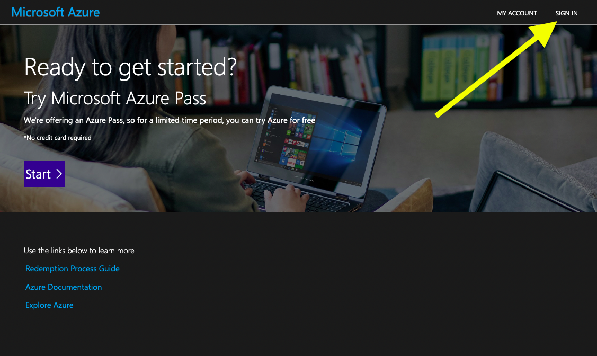


## Activate Cloud Shell

Select PowerShell.

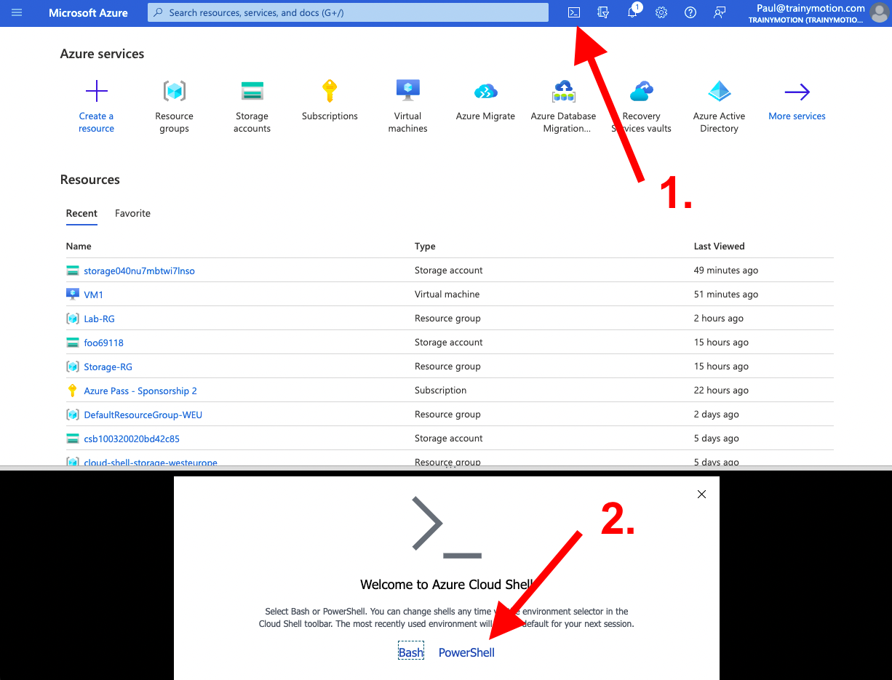

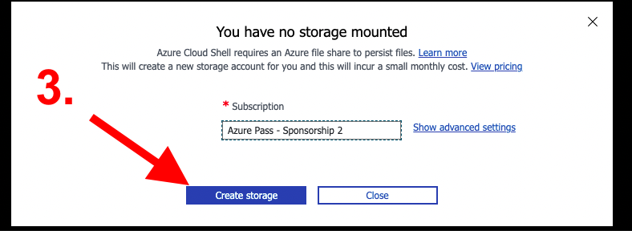


## Clone github repo

```
git clone https://github.com/www42/AZ-040-Student.git
```

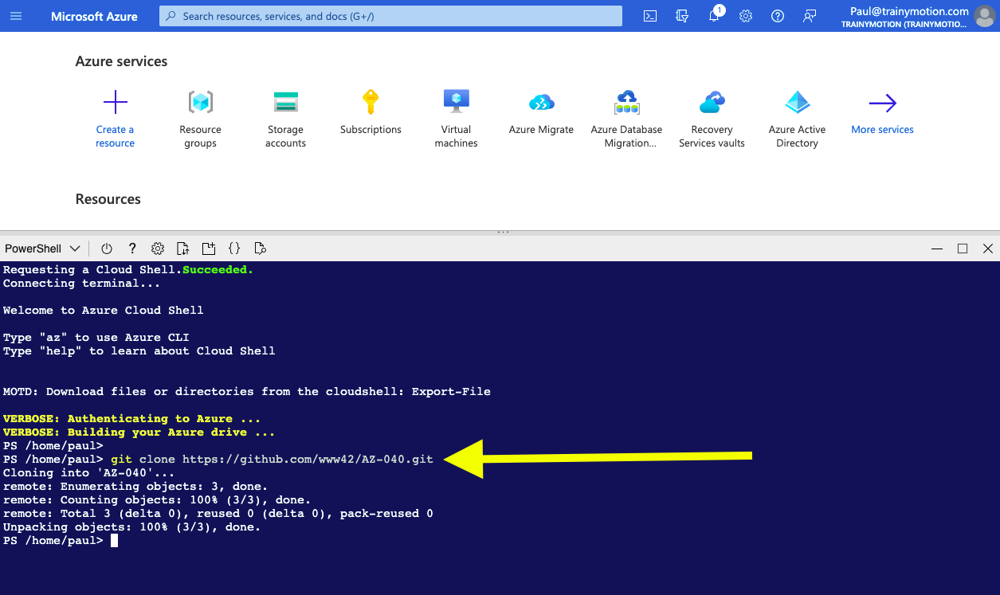


## Deploy ARM template

``` 
cd AZ-040-Student
./Deploy-Template.ps1
```

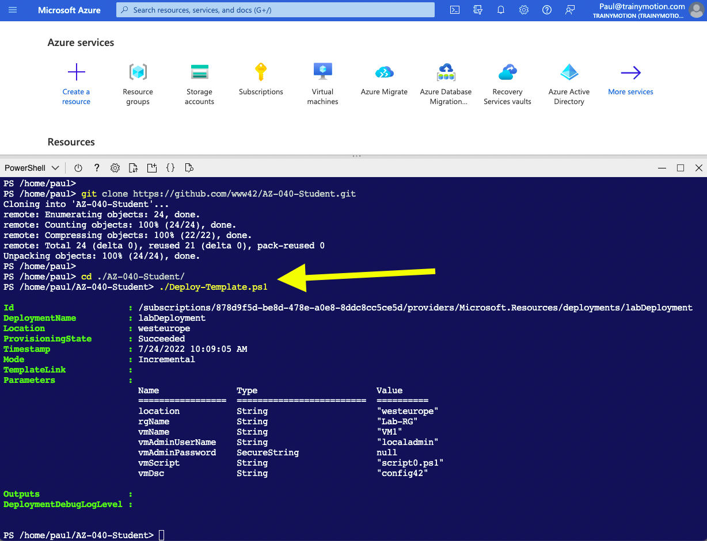


## Connect to virtual machine

Select Bastion. Login with username localadmin. Start PowerShell ISE.

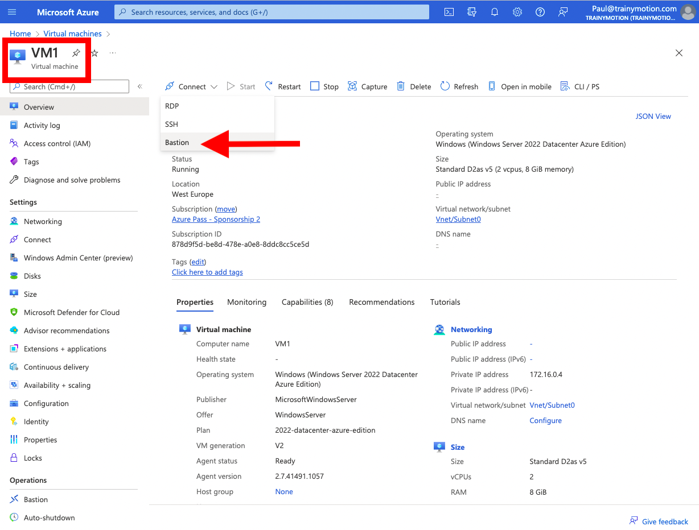

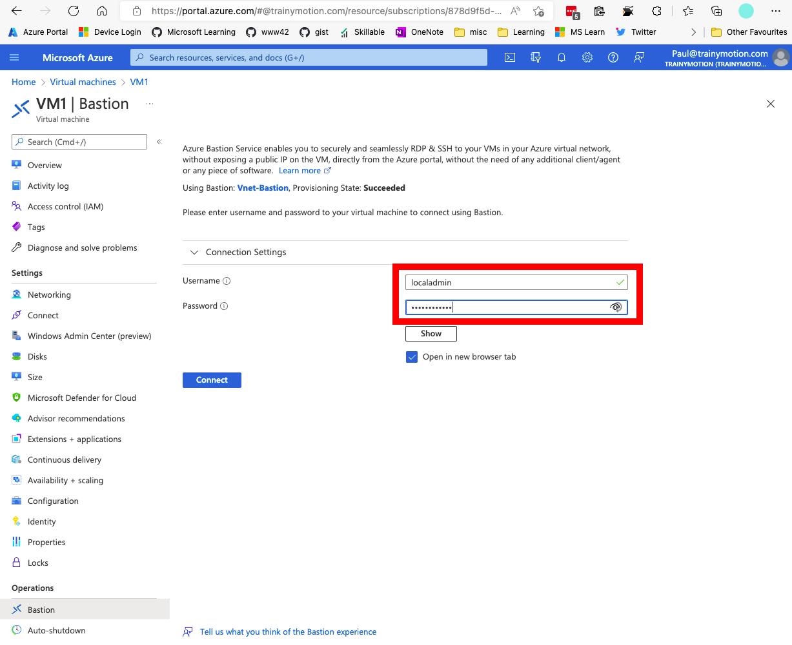

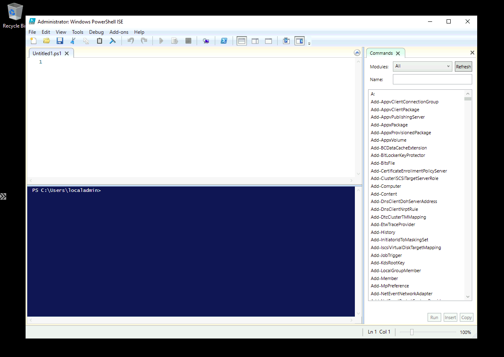


## Optional - Mount file share

Go to storage account named storage040...

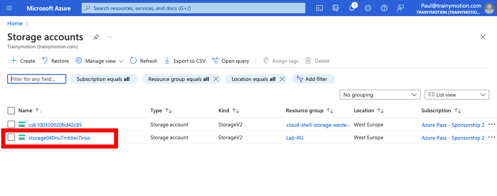

Locate the file share named powershell

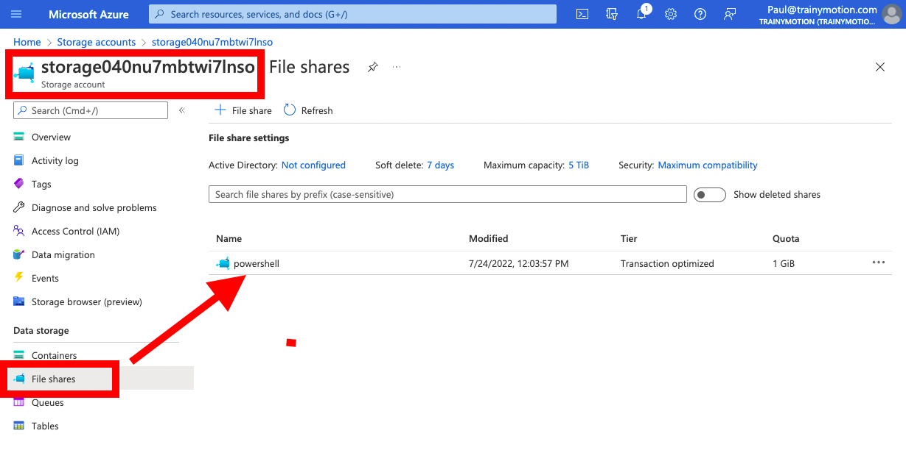

Click Connect. Copy the PowerShell script (grey box) to clipboard.

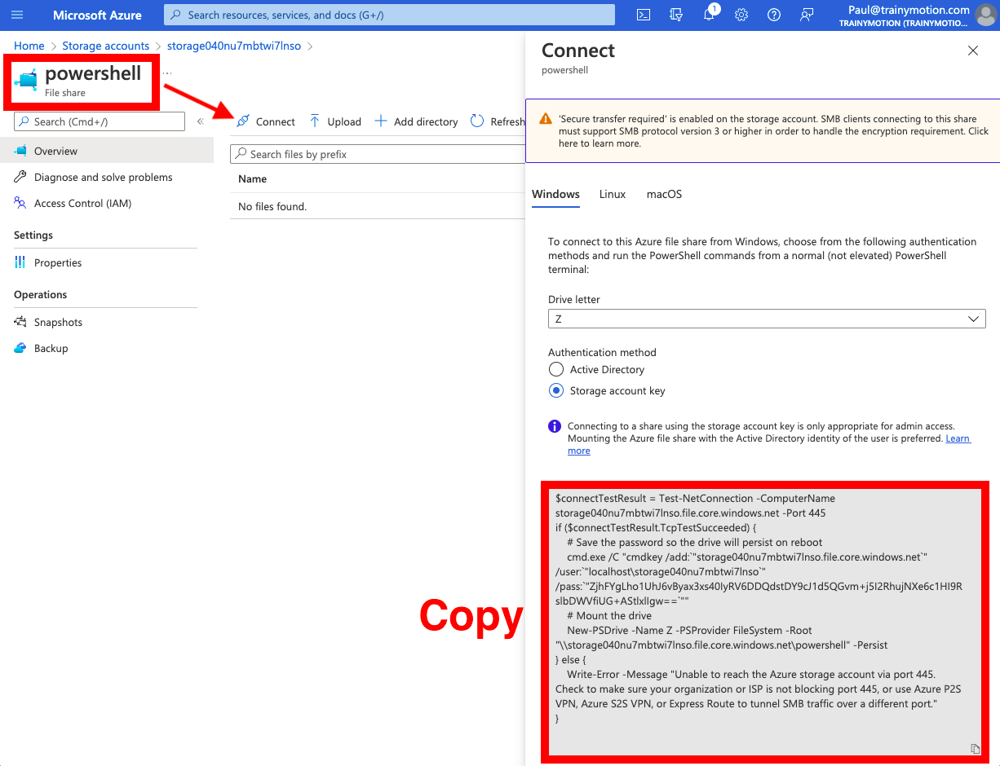

Paste the script into PowerShell ISE and Run Script (F5)

